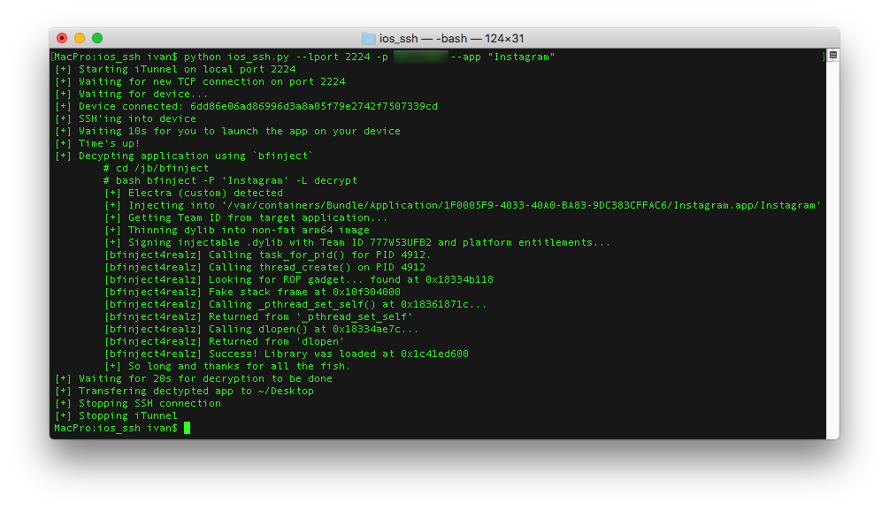

# Decrypt iOS Apps
Python script to SSH into your jailbroken device via USB, decrypt an iOS App and transfer it to your local machine

## Dependencies
- [Paramiko](http://www.paramiko.org/):
  - Description: Paramiko is a Python (2.7, 3.4+) implementation of the SSHv2 protocol
  - Install: `pip install paramiko`
  
- [iTunnel](https://code.google.com/archive/p/iphonetunnel-usbmuxconnectbyport/downloads):
  - Description: A simple command line tool which provides network tunnelling over the USB cable to a jailbroken iDevice
  - Install: [Download](https://code.google.com/archive/p/iphonetunnel-usbmuxconnectbyport/downloads) the latest and copy to `/usr/local/bin`

## Assumptions
- You have either [`clutch`](https://github.com/KJCracks/Clutch) or [`bfinject`](https://github.com/BishopFox/bfinject) setup on your device.
- If you use `clutch`, it should be executable from any path.
- If you use `bfinject` the scripts and libraries should be in the `/jb/bfinject` directory. [Here's how to setup `bfinject` this way](https://ivrodriguez.com/reverse-engineer-ios-apps-ios-11-edition-part1/).
- This script was **only** tested on devices jailbroken with [LiberiOS](http://newosxbook.com/liberios/) and [Electra](https://coolstar.org/electra/), but it might work with other jailbreaks.

## Usage
```
ios_ssh.py -l <port> [-p <password>] -a <app_name> [-c|-b] [-i]
  -l [--lport]: Local SSH port forwarding (has to be an Int)
  -p [--password]: (optional) Device's root password (default is `alpine`)
  -a [--app]: iOS Application name
  -c : Use Clutch to decrypt
  -b : Use BFInject to decrypt (default)
  -i : Opens a SSH connection with the device and gives an interactive shell, ignoring the decryption task
```

## Examples
- This will decrypt the `Instagram` app and transfer it from your device to your `~/Desktop`:
  - `python ios_ssh.py --lport 2222 -p s3cr37 --app "Instagram"`


- This will give you an interactive shell to communicate with your device over USB:
  - `python ios_ssh.py --lport 2222 -p s3cr37 -i`


